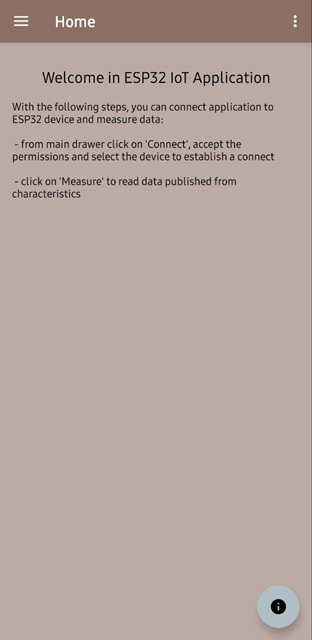
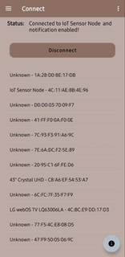
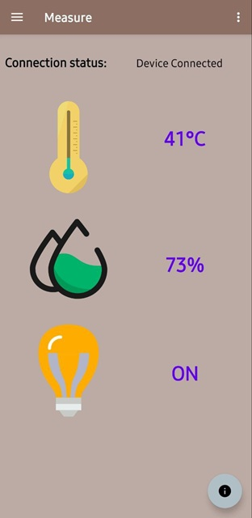

# Android IoT Application

# 📟 Project
It consists on Android application able to connect and communicate via BLE to ESP32 device. Source code for ESP32 device is available here: https://github.com/MpDev89/ESP32_BLE.git. Application is designed like BLE peripheral capable to read data from environmental sensing service composed from three characteristics (temperature, humidity and solar radiation).

## 🚀 Features
- ✅ Application layout designed with main drawer
- ✅ Unit interface for main page
- ✅ Unit interface for device bonding
- ✅ Unit interface for data reading

## 🚀 Code Features
- ✅ BroadcastReceiver for bonding procedure
- ✅ BluetoothGattCallback for device bonding, services discovering, characteristics reading and descriptor writing
- ✅ GattUpdateReceiver to handle the main gatt updating

## 🔧 Requirements
- Toolchain:
      Android Studio Narwhal 4 Feature Drop | 2025.1.4
      Build #AI-251.27812.49.2514.14217341, built on October 6, 2025
      Runtime version: 21.0.8+-14018985-b1038.68 amd64
      VM: OpenJDK 64-Bit Server VM by JetBrains s.r.o.
      Toolkit: sun.awt.windows.WToolkit
      Windows 11.0
      Kotlin plugin: K2 mode
- Hardware: Smartphone Android
- Programming Interface: USB TYPE C

## 🛠️ Technologies
- Languages: Java
- Framework: none
- Libraries: see "build.gradle.kts" file

## 🏗️ Hardware Setup
Your smartphone

## 🏗️ Software Toolchain Setup
- Install Android Studio Narwhal 4
- Open existing project

## 📦 Github Setup
Clone the repository:
```bash
git clone https://github.com/MpDev89/ESP32_IoT_AndroidApp.git
cd project-name
```
## 🗒️ Results
Application can be integrated with simple setup with [ESP32 device.](https://github.com/MpDev89/ESP32_BLE/blob/a50febc179277de238a71ffb6773c1ffd27bdf55/Readme.md) or using [IoT embedded application.](https://github.com/MpDev89/ESP32_IoT/blob/06ebec6d9167bcdd1a8b6634c39cf4a7ef79a2f8/Readme.md)
Main page layout:



Connection to device can be managed in this layout clicking on item from device list.



Measure layout permit to read characteristic value transmitted from server.




## 🌐 Contatti
[](mailto:mp@tech-in-mind.it)  
[](https://www.linkedin.com/in/marconatale-parise-48a07b94)  
[](https://github.com/MpDev89)
